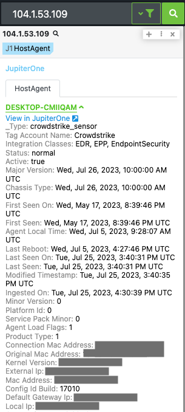
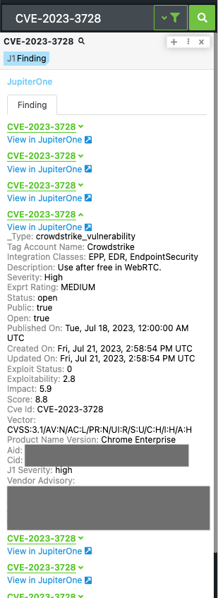
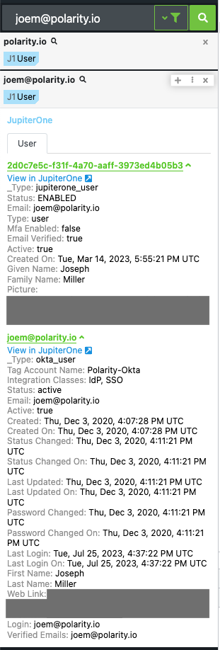

# Polarity JupiterOne Integration


JupiterOne is a platform that allows you to secure your attack surface with continuous asset discovery and attack path analysis.

The Polarity JupiterOne Integration allows you to search all standard Asset Types, including Hosts Users Findings & Records, by all entity types, including IP Addresses, Hostnames, Email Addresses, Domains, and more.

<div style="display:flex; align-items: flex-start; justify-content:flex-start; align-items:flex-start;">
  
  
</div>
<div style="display:flex; align-items: flex-start; justify-content:flex-start; align-items:flex-start;">
  
</div>

To learn more about JupiterOne, visit the [official website](https://www.jupiterone.com/).

## JupiterOne Integration Options

### Instance ID
The Instance ID found in your JupiterOne instance's URL `https://<instanceID>.apps.us.jupiterone.io/`.

### Account ID
Your JupiterOne Account ID found in `Settings -> Profiles`

### Access Token
Your JupiterOne Access Token found in `Settings -> User API Tokens`

### Search Asset Types
The Asset Class Types you want to search.  Example results can be found at "https:/<instanceID>.apps.us.jupiterone.io/assets/inventory"

***Default***: `Host, User, Finding, Record`

***Possible Values***: 
```txt
Configuration, ControlPolicy, Question, Record, Resource, Rule, Finding, Monitor, Document, Policy, Organization, Person, Root, Vendor, Domain, DomainRecord, DomainZone, Firewall, Gateway, Internet, IpAddress, Network, NetworkEndpoint, NetworkInterface, AccessKey, AccessPolicy, AccessRole, Account, Certificate, CryptoKey, Everyone, Key, PasswordPolicy, Secret, User, UserGroup, Backup, Database, DataStore, Disk, Logs, Queue, Host, HostAgent, Image, Task, Application, ApplicationEndpoint, Channel, Group, Repository, Service, Subscription
```

## Installation Instructions

Installation instructions for integrations are provided on the [PolarityIO GitHub Page](https://polarityio.github.io/).

## Polarity

Polarity is a memory-augmentation platform that improves and accelerates analyst decision making. For more information about the Polarity platform please see:

https://polarity.io/
